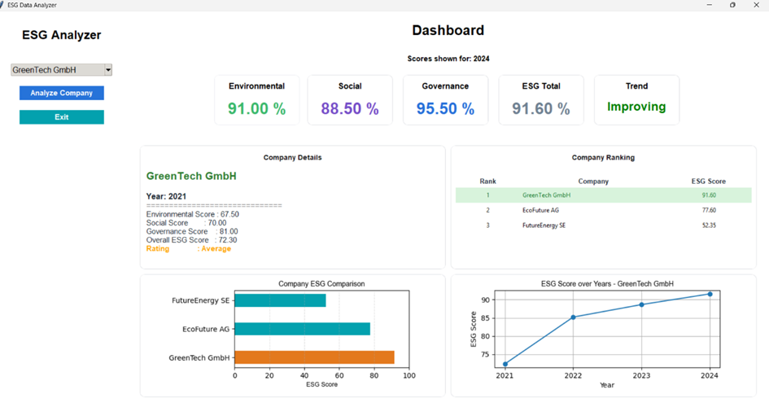

Python Final Project ReDi School

ESG Data Analyzer Dashboard

A Python desktop dashboard application for analyzing and visualizing ESG (Environmental, Social, and Governance) company data, inspired by two IBM SkillsBuild courses, “Fundamentals of Sustainability “ and “Technology and Python for Data Science”

Features:

- ESG score calculation
- ESG company ranking with highlighted selected company
- Multi-year ESG trend analysis
- ESG trend classification (Improving, Stable, Declining)
- Interactive dashboard interface
- Company comparison charts
- Embedded Matplotlib charts inside Tkinter frames
- Modern UI using CustomTkinter

Technologies Used:

- Python
- Tkinter
- CustomTkinter
- Matplotlib
- JSON

Installation:

1. Clone the repository: git clone https://github.com/ShiriSalman/My_Final_Project.git

2. Create virtual environment: python -m venv .venv

3. Activate virtual environment:

- Windows:
   powershell:  .venv\Scripts\Activate.ps1
   cmd:         .venv\Scripts\activate.bat
   bash:        source .venv/Scripts/activate

- MacOS / Linux: source .venv/bin/activate

4. Install dependencies: pip install -r requirements.txt

5. Run the application

Run the GUI Application: python app.py
Run the CLI Version: python main.py

Dashboard Components:

- ESG score cards
- ESG trend chart
- Company ranking table
- ESG comparison chart
- Company details panel

Notes and Assumptions:

- The ESG values used in this project are fictional sample data for demonstration purposes.
- Environmental, Social, and Governance scores are calculated as the average of their respective indicators.
- The overall ESG score is based on a simplified weighted model:
    - Environmental: 40%
    - Social: 30%
    - Governance: 30%
- The application supports multi-year ESG data, company rankings, comparisons, and basic trend analysis.
- This project is intended as an educational example. Real-world ESG scoring frameworks are significantly more complex and rely on    larger datasets and industry-specific standards.

Future Improvements:

- Real ESG datasets 
- Database integration 
- Advanced ESG analytics 
- Web application version 
- API integration
- Export reports as PDF
- Interactive filters
- Dark mode support

AI Assistance:

AI tools were used as a learning and support resource during the development process.
Specifically, AI assistance helped with:

- Creating the initial sample ESG dataset (esg_data.json) used for demonstration purposes.
- Troubleshooting and debugging implementation issues.
- Understanding and learning how to implement new GUI features using Tkinter and CustomTkinter, as well as how to integrate and display   Matplotlib charts within Tkinter frames.
- Improving the formatting and presentation of output within the GUI.

The application design, ESG scoring model, project structure, implementation, testing, and integration of all components were completed by the developer.

Resources Used:

- https://www.w3schools.com/python/python_dictionaries.asp
- https://www.learnpython.org/
- https://www.pythonguis.com/tutorials/create-ui-with-tkinter-grid-layout-manager/
- https://docs.python.org/3/library/tkinter.ttk.html
- https://tkdocs.com/tutorial/tree.html
- https://customtkinter.tomschimansky.com/documentation/widgets/combobox/
- https://customtkinter.tomschimansky.com/tutorial/frames/
- https://stackoverflow.com/questions/79930157/how-to-delete-every-widget-in-tkinter
- https://www.w3schools.com/PYTHON/matplotlib_pyplot.asp
- https://tkdocs.com/tutorial/styles.html
- https://www.pythontutorial.net/tkinter/tkinter-matplotlib/
- https://matplotlib.org/stable/tutorials/index.html
- https://realpython.com/search?q=gui

Author
Shireen Alsalman

